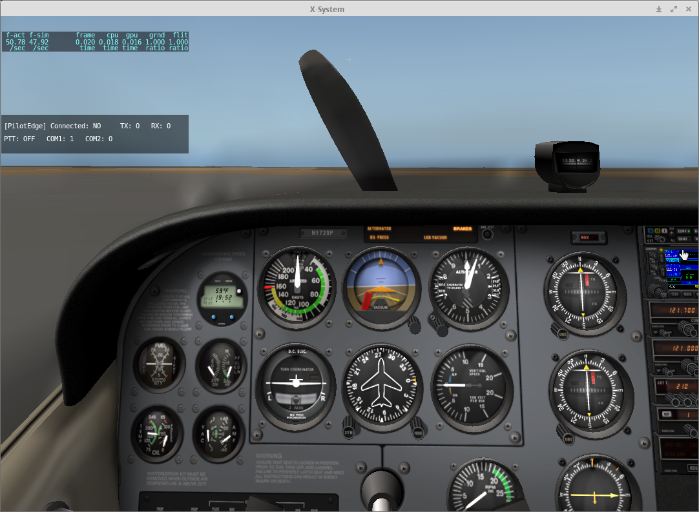

#### CommViewer

Draws a small, mouse moveable/clickable, text box in the upper left hand corner
of the simulator screen. The output shows PilotEdge Connection, PTT (Push-To-Talk),
TX/RX, Com1, and Com2 status.

When the output box is clicked on, the plugin will select an unselected Com
or unselect a Com previously selected via mouse click. Typically, this is useful
for listening to ATIS information without having to leave the primary Com. Note,
for aircraft with an audio panel that allows multiple Com selection, the mouse
click is ignored.

To move the window, place the mouse pointer over the window, hold down the
left mouse button, move the window to the desired location and release the
mouse button.


#### Example Output (COMx: 0=Unselected, 1=Selected, TX/RX: ON=1, OFF=0):
```
[Pilot Edge] Connected: YES     TX: 0   RX: 1
PTT: OFF   COM1: 1   COM2: 0
```
```
[Pilot Edge] Connected: NO      TX: 0   RX: 0
PTT: ON    COM1: 1   COM2: 0
```
```
[Pilot Edge] Connected: YES     TX: 1   RX: 0
PTT: OFF   COM1: 1   COM2: 1
```




#### Build Dependencies

- The [Nim Language compiler](http://nim-lang.org/download.html).
- [XPLM-Nim package](https://github.com/jpoirier/XPLM-Nim). You
can fetch the package using the Nimble tool, if you have it installed
(Nimble install XPLM-Nim), or clone the repo and set the Nim compiler's
path argument to point to XPLM-Nim's src folder. E.g., --p:~/downloads/XPLM-Nim/src


#### Building The Plugin
Issue one of the following commands in a shell window:

`$ nim c -o:CommViewer.xpl CommViewer.nim`

`$ nim c -p:~/downloads/XPLM-Nim/src -o:CommViewer.xpl CommViewer.nim`


Then move the ViewerComm.xpl plugin to your X-Plane 10/Resources/plugins folder.


#### Todo

- add hotkey handling to hide the window
- add comm audio volume control


#### Misc/Notes


#### Versions

- 1.0 Initial working build
